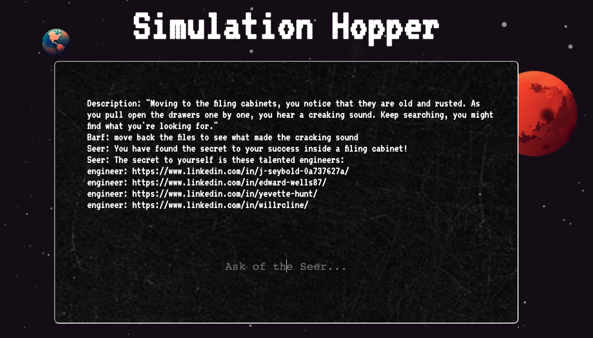

## Simulation Hopper: Planet Hopper Version 2.0

Get ready for an immersive journey through a universe that perfectly juxtaposes the cutting-edge power of AI with the timeless retro style of Zelda and Pokemon. As the player, you'll navigate through captivating and complex narratives, engage in intriguing mini-games, and interact with the world around you using natural language processing. All the while, you're accompanied by a clever, riddle-speaking robot sidekick.

## Game Story

Our protagonist, Barf, is an outcast from a distant corner of the universe. His home planet is dying, with plants wilting away and oxygen levels plummeting. Armed with nothing but a fragmented ship and a scribbled map, Barf embarks on a mission to save his world. Along the way, he navigates the complexities of interplanetary trade, interacts with diverse characters, and grapples with his own limitations. His heroic journey is fraught with humor, heart, and a fair share of unexpected mishaps (including a rather unfortunate loss of pants).

## What's New in Version 2.0?

More playable: Enhanced gameplay features and mechanics have been introduced to elevate the player experience.
More AI innovation: The cutting-edge AI dialogue system has been refined to deliver more immersive conversations and dynamic responses.
Mini Games: Engage in 3 new AI-powered mini-games for an added layer of fun and challenge.
Dynamic NPCs: Each non-playable character possesses a unique personality and story, enhancing the overall depth of the game.
Intriguing storylines: Immerse yourself in a narrative that humorously and poignantly explores themes of climate change, simulation theory, and interspecies romance.

## Future Improvements

Expanded Game World: Discover hidden treasures, secret areas, and undiscovered locations.
Resource Gathering and Crafting: Gather resources and craft or enhance your items.
NPC Interactions: Develop friendships, romances, or rivalries with NPCs. Your choices will influence the storyline, rewards, and possible NPC companions.

## Team Members:

J Seybold
Will Cline
Edward Wells
Yevette Hunt

## Tools and Utilities:

MongoDB
GraphQL
OpenAI API
Tiles
Midjourney
JWT

## Contact:

 - J Seybold: [GitHub](https://github.com/clever-girl31)
 - Will Cline: [GitHub](https://github.com/willrcline)
 - Edward Wells: [GitHub](https://github.com/edwardwells87)
 - Yevette Hunt: [GitHub] (https://github.com/yveivy)

## Deployed Site:

[Simulation Hopper](https://simulationhopper.herokuapp.com/)   
